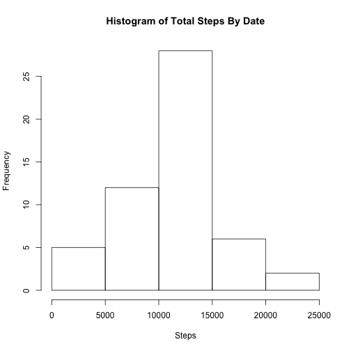
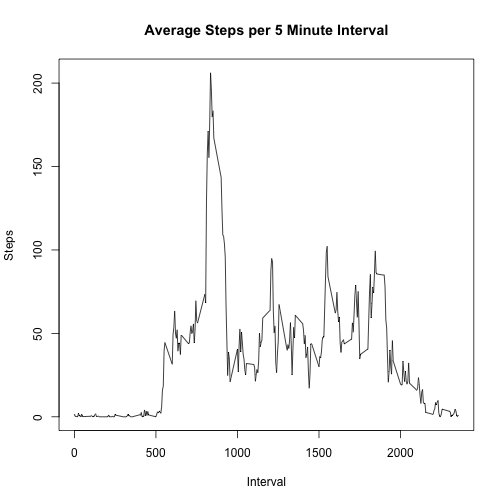
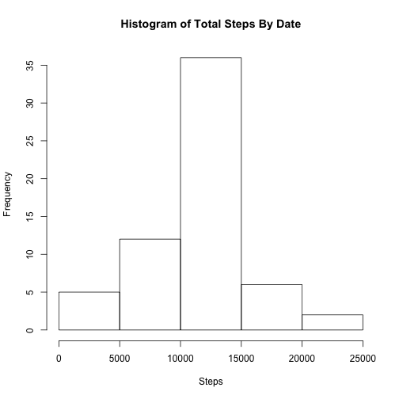
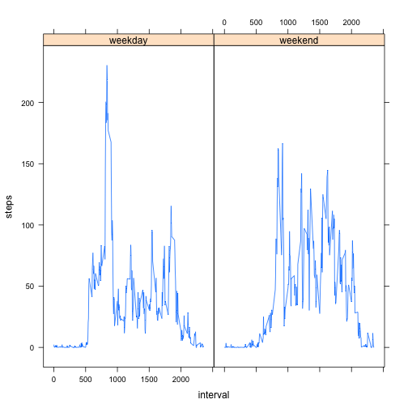

"Week 1 Assignment"
=========================


Read Data

```r
activity <- read.csv('activity.csv')
```

Calculate total steps by day and create histogram

```r
total_steps_by_day <- aggregate(steps ~ date, data = activity, sum )
hist(total_steps_by_day$steps, main = 'Histogram of Total Steps By Date', xlab= 'Steps')
```



Calculate average total steps by day

```r
mean(total_steps_by_day$steps)
```

```
## [1] 10766.19
```

Calculate median total steps by day

```r
median(total_steps_by_day$steps)
```

```
## [1] 10765
```

Calculate average steps per interval and create time series plot

```r
average_steps_per_interval <- aggregate(steps ~ interval, data = activity, mean)
plot(average_steps_per_interval, 
     type = 'l', 
     main = 'Average Steps per 5 Minute Interval', 
     xlab = 'Interval', 
     ylab= 'Steps'
)
```



Determine 5-minute interval with the highest average steps

```r
row_with_max_steps = which.max(average_steps_per_interval$steps)
average_steps_per_interval[row_with_max_steps,]$interval
```

```
## [1] 835
```

Calculate total number of missing values

```r
sum(is.na(activity$steps))
```

```
## [1] 2304
```

To fill in missing values, I created a dataframe by merging the missing values from the activity dataset with the average steps per interval dataset. I used the new dataframe to replace missing values in the original dataframe with the average number of steps for their respective 5 minute interval.

```r
nas_with_average_steps <- merge(activity[is.na(activity$steps),], 
                                average_steps_per_interval, 
                                by = 'interval')

activity[is.na(activity$steps), 1] <- nas_with_average_steps[order(nas_with_average_steps$date), 4]
```

Recreate total steps by day histogram with missing values filled in.
The histogram is very similar to the initial histogram.

```r
total_steps_by_day <- aggregate(steps ~ date, data = activity, sum )
hist(total_steps_by_day$steps, main = 'Histogram of Total Steps By Date', xlab= 'Steps')
```



The mean with missing values filled in remains the same.

```r
mean(total_steps_by_day$steps)
```

```
## [1] 10766.19
```

The median with missing values filled in is now the same as the mean.

```r
median(total_steps_by_day$steps)
```

```
## [1] 10766.19
```

Add column to activity dataframe indicating whether each date is a weekday or weekend

```r
weekends_logical <- weekdays(as.Date(activity$date)) %in% c("Saturday", "Sunday")
activity$day_type <- ifelse(weekends_logical, "weekend", "weekday")
```

Create time series plot of average steps per interval divided by day type

```r
library('lattice')
avg_steps_per_interval_and_day_type <- aggregate(steps ~ interval + day_type, data = activity, mean)
xyplot(steps ~ interval | factor(day_type), data = avg_steps_per_interval_and_day_type, type = 'l')
```


